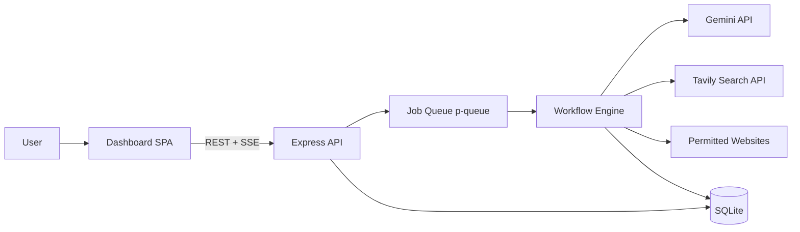
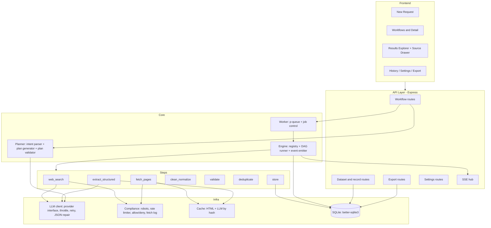
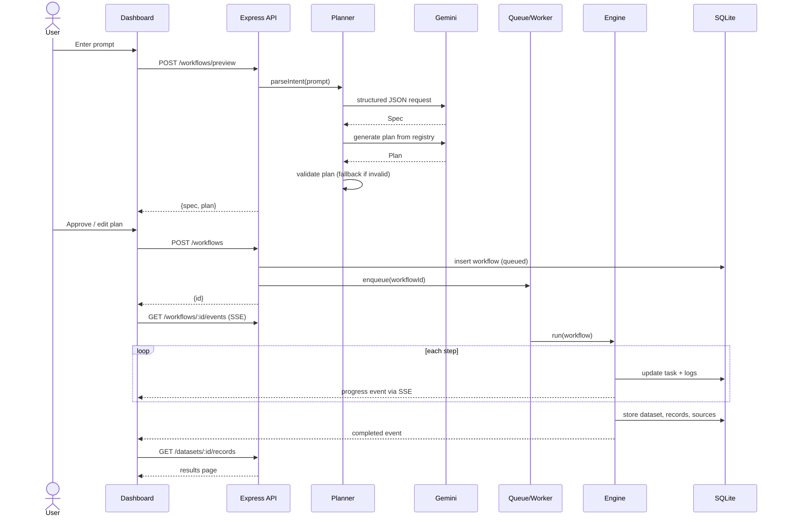
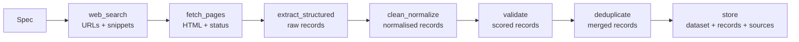
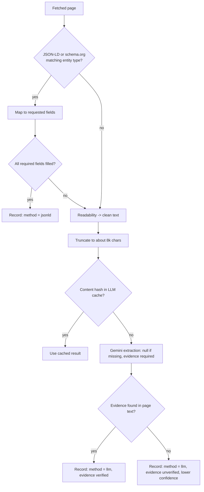
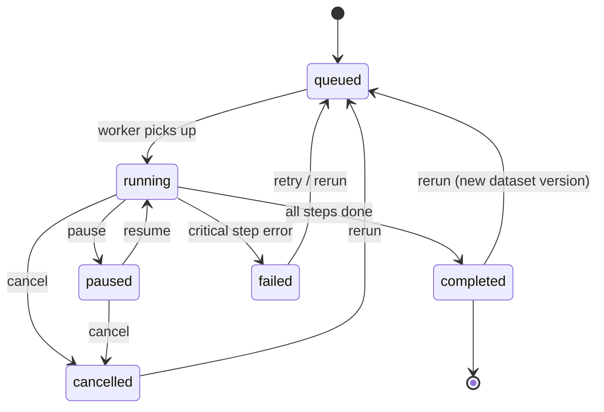
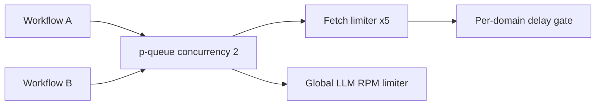
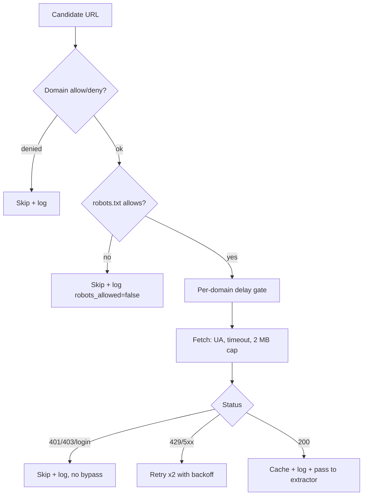
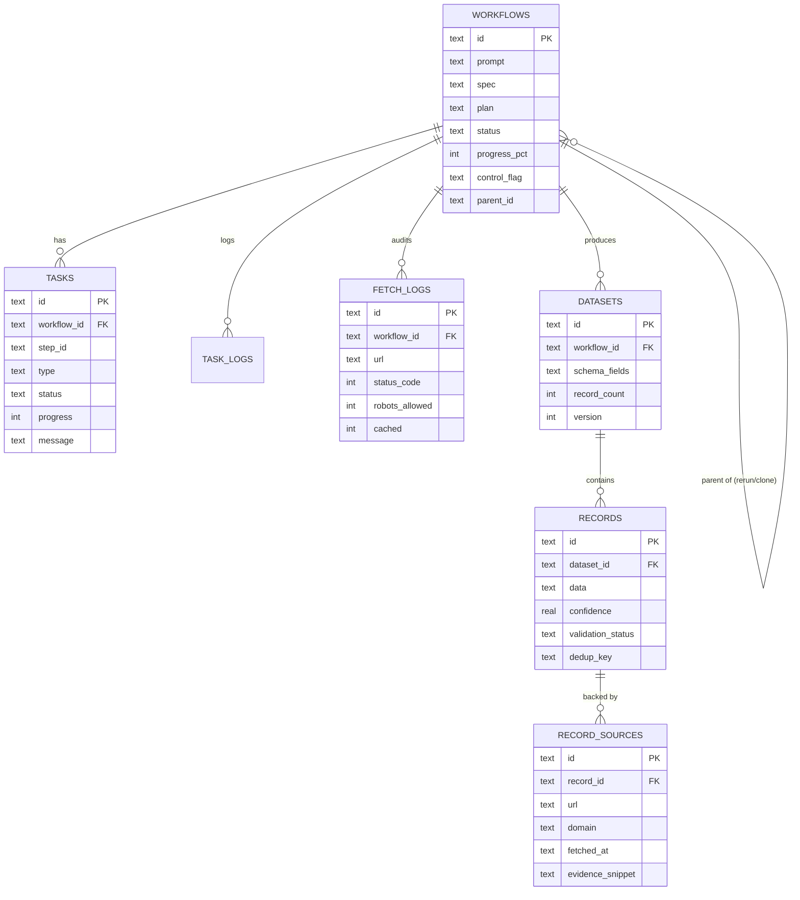
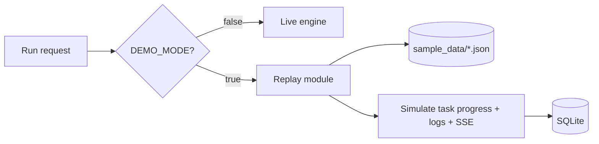

# ARCHITECTURE.md: AI-Powered Data Intelligence Platform

Node.js backend, single-page dashboard, SQLite storage, in-process job queue.

---

## 1. Architectural style

- **Modular monolith:** one Node process containing API, queue, engine, and static frontend
- **Plan-then-execute:** the LLM produces a declarative plan; a deterministic engine executes it
- **Pipeline of pure-ish steps:** each step takes the previous step's output and returns new data plus progress events
- **Event-driven progress:** the engine emits events; SSE and the database consume them

## 2. System context



## 3. Component diagram



## 4. Module map (folder to responsibility)

```
project/
├─ src/
│  ├─ server.js              # Express app bootstrap, static hosting, routes mount
│  ├─ config.js              # env loading and validated settings (Zod)
│  ├─ db/
│  │  ├─ index.js            # better-sqlite3 connection, migrations
│  │  ├─ schema.sql          # tables
│  │  └─ repo.js             # query helpers (workflows, tasks, records, sources, logs)
│  ├─ llm/
│  │  ├─ index.js            # provider interface: generateJson({system, prompt, schema})
│  │  ├─ gemini.js           # Gemini implementation
│  │  └─ limiter.js          # global RPM limiter + backoff
│  ├─ planner/
│  │  ├─ intent.js           # prompt -> Spec
│  │  ├─ plan.js             # Spec -> Plan
│  │  ├─ validate.js         # plan validation + default plan
│  │  └─ schemas.js          # Zod schemas: Spec, Plan, StepParams
│  ├─ engine/
│  │  ├─ registry.js         # step registry
│  │  ├─ runner.js           # topo sort, execution, control flag checks
│  │  ├─ context.js          # per-run ctx: emit(), log(), shouldStop(), settings
│  │  └─ worker.js           # queue, job lifecycle, retry/rerun/clone
│  ├─ steps/
│  │  ├─ webSearch.js
│  │  ├─ fetchPages.js
│  │  ├─ extractStructured.js
│  │  ├─ cleanNormalize.js
│  │  ├─ validate.js
│  │  ├─ deduplicate.js
│  │  └─ store.js
│  ├─ compliance/
│  │  ├─ robots.js           # per-domain robots cache + decision
│  │  ├─ rateLimiter.js      # per-domain delay
│  │  └─ domains.js          # allow/deny list
│  ├─ cache/index.js         # disk cache (HTML, LLM outputs)
│  ├─ routes/                # workflows.js, datasets.js, records.js, export.js, settings.js, events.js
│  ├─ export/                # csv.js, xlsx.js
│  └─ demo/replay.js         # DEMO_MODE replay
├─ public/                   # dashboard (index.html, app.js, styles)
├─ sample_data/              # cached demo datasets
├─ tests/
├─ data/                     # sqlite file, cache
├─ package.json
└─ .env.example
```

## 5. Request lifecycle



## 6. Pipeline data flow



| Stage | In | Out | Persisted |
|---|---|---|---|
| web_search | spec | `[{url,title,snippet}]` | task log |
| fetch_pages | URLs | `[{url,html,status,fetchedAt}]` | `fetch_logs`, disk cache |
| extract_structured | pages | `[{data,sources,method}]` | LLM cache |
| clean_normalize | records | records | none |
| validate | records | records + confidence + status | none |
| deduplicate | records | merged records | none |
| store | records | dataset id | datasets, records, record_sources |

## 7. Extraction decision tree



## 8. Workflow state machine



Task status: `pending → running → completed | failed | skipped`.

**Control mechanism:** the `workflows.control_flag` column (`none | cancel | pause`). The engine checks `ctx.shouldStop()` between units of work (per URL fetched, per page extracted, per batch). On cancel it stops cleanly and stores partial results.

## 9. Concurrency model

- One Node event loop; all I/O is async
- **Workflow level:** `p-queue` with concurrency 2 (configurable) so multiple workflows can run
- **Fetch level:** inner limiter with concurrency 5 (`FETCH_CONCURRENCY`), but the per-domain rate limiter serialises requests to the same domain with at least `PER_DOMAIN_DELAY_MS` between them
- **LLM level:** a single global RPM limiter (token bucket) shared by every LLM call, so free-tier quotas are never exceeded across workflows
- SQLite writes go through `better-sqlite3` (synchronous, WAL mode on) inside short transactions; batch inserts for records



## 10. Compliance architecture



Every branch writes a `fetch_logs` row, which feeds the "Sources used" panel in the dashboard.

## 11. Data architecture



- Record `data` is a JSON text column, so any schema works without migrations
- Filtering on dynamic fields uses SQLite `json_extract(data, '$.field')`
- Global search uses `LIKE` over the JSON text (fast enough for thousands of rows); FTS5 is a future upgrade
- Indexes: `records(dataset_id)`, `records(confidence)`, `records(dedup_key)`, `tasks(workflow_id)`, `workflows(status, created_at)`

## 12. LLM integration design

```
llm.generateJson({ system, prompt, schema (Zod) }) -> validated object
```

1. Convert Zod schema to JSON Schema for Gemini structured output (fallback: instruct JSON in the prompt)
2. Acquire a token from the global RPM limiter
3. Call Gemini; on 429/5xx retry with exponential backoff + jitter (max 4 tries)
4. Parse JSON, validate with Zod; on failure send one repair request including the error
5. Return typed object or throw `LlmError`

**Provider interface:** `gemini.js` implements `generateJson`. Adding OpenAI or Claude means adding one file and setting `LLM_PROVIDER`.

**Cost/quota controls:** JSON-LD before LLM, truncation, content-hash cache, batch small pages, cap pages per workflow.

## 13. Real-time updates (SSE)

- Endpoint: `GET /api/workflows/:id/events`
- Engine emits events through an in-process `EventEmitter`; the SSE hub forwards them to subscribed clients
- Event types: `workflow_status`, `task_update`, `progress`, `log`, `stats`
- Clients reconnect automatically; on reconnect the UI fetches current state via `GET /api/workflows/:id` to resync
- Fallback: the UI polls every 2 seconds if SSE fails

## 14. Error handling strategy

| Failure | Handling |
|---|---|
| LLM 429/5xx | Backoff and retry; if exhausted, task fails with message; fetched pages remain cached |
| Invalid LLM JSON | Zod parse, one repair retry, then fall back (default plan or skip page) |
| Invalid plan | Fallback plan template |
| Page fetch error | Retry x2; log and skip; workflow continues |
| Non-critical step error | Mark task failed, continue if downstream can run |
| Critical step error | Workflow `failed`; partial data kept; "Retry failed step" available |
| Process restart mid-run | On boot, workflows stuck in `running` are set to `failed` with a recoverable message; user can retry |
| Cancel | Clean stop, partial results stored |

Retry semantics: `retry` re-runs failed/pending tasks reusing cached fetch and LLM results; `rerun` creates a new workflow linked by `parent_id` and increments dataset version.

## 15. Security and privacy

- API keys only in `.env`; never sent to the frontend
- LLM never returns code that is executed; plans are data validated against a whitelist
- Outbound fetch guardrails: only `http/https`, block private IP ranges and `localhost` (SSRF protection), response size cap, timeout
- Sanitise all record values before rendering in the dashboard (escape HTML) to prevent XSS from scraped content
- Rate limiting on `POST /api/workflows` to prevent accidental floods
- Free-tier LLM data may be used to improve the provider's products; avoid sending sensitive data

## 16. Performance notes

- Typical run: 3-6 queries, up to 40 pages, extraction in batches; target under 3-5 minutes on free-tier limits
- SQLite in WAL mode; batch inserts in one transaction
- HTML and LLM caches make re-runs and retries fast and cheap
- Pagination is server-side for the results table

## 17. Demo mode architecture



Replay inserts the same rows a live run would (workflow, tasks, logs, dataset, records, sources), so the UI is identical.

## 18. Testing architecture

| Level | What | Tools |
|---|---|---|
| Unit | plan validation, dedup, date normalisation, robots decisions, confidence scoring, Zod schemas | vitest |
| Integration | full pipeline against a local mock HTTP server (pages with and without JSON-LD, a robots.txt) and a mocked LLM | vitest + local http server |
| Manual | 3 demo prompts end to end with real keys | checklist in `brain.md` |

## 19. Deployment

- **Local (primary):** `npm install && npm start`, open `http://localhost:8000`
- **Optional:** deploy to any Node host (Render, Railway, a VPS) with a persistent disk for SQLite
- Note: static hosting alone will not work because the backend needs a running Node process

## 20. Scaling path

| Today | Later |
|---|---|
| SQLite | PostgreSQL (JSONB, FTS) |
| In-process `p-queue` | BullMQ + Redis with separate worker processes |
| Disk cache | Redis / S3 |
| Single Node process | Horizontal API + worker pool |
| Fetch only | Optional Playwright worker for permitted JS-rendered pages |
| Manual runs | Scheduler (cron / BullMQ repeatable jobs), incremental runs |

Because steps are stateless functions with a clear input/output contract, moving them to separate workers needs no redesign.

## 21. Key design decisions and trade-offs

| Decision | Benefit | Trade-off |
|---|---|---|
| LLM emits a plan, not code | Safe, testable, predictable | Limited to registry capabilities (extend by adding steps) |
| JSON columns for record data | Any schema works instantly | Dynamic-field queries are slower than typed columns |
| In-process queue | Zero infra | Jobs are lost on crash (mitigated by status recovery on boot) |
| JSON-LD first, LLM second | Cheaper, more accurate, fewer rate-limit hits | Only helps on pages that ship structured data |
| No headless browser | Simple, light, more compliant | JS-only pages yield little |
| Static SPA | No build step, fast to ship | Less structured than a full framework |
